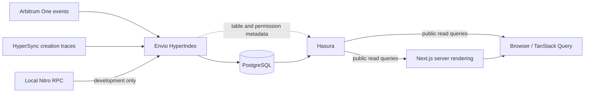

# Architecture

## Components and boundaries

| Component          | Responsibility                                                    | Source                                                                                                                                                                                                                                |
| ------------------ | ----------------------------------------------------------------- | ------------------------------------------------------------------------------------------------------------------------------------------------------------------------------------------------------------------------------------- |
| `packages/indexer` | Event ingestion, creation discovery, normalization and aggregates | [configuration](https://github.com/CoBuilders-xyz/stylus-dashboard/blob/release/packages/indexer/config.arbitrum-one.yaml), [handlers](https://github.com/CoBuilders-xyz/stylus-dashboard/tree/release/packages/indexer/src/handlers) |
| PostgreSQL         | Persist entities, indexing progress and effect cache              | Managed by Envio locally; persistent Railway service in production                                                                                                                                                                    |
| Hasura             | Expose entity reads, filters, ordering, pagination and aggregates | Schema generated from [schema.graphql](https://github.com/CoBuilders-xyz/stylus-dashboard/blob/release/packages/indexer/schema.graphql)                                                                                               |
| `apps/web`         | Five dashboard routes, server initial data and client updates     | [app](https://github.com/CoBuilders-xyz/stylus-dashboard/tree/release/apps/web/src/app), [GraphQL queries](https://github.com/CoBuilders-xyz/stylus-dashboard/blob/release/apps/web/src/lib/graphql/queries.ts)                       |
| `scripts`          | Devnode setup, seeding, permission maintenance and report capture | [scripts](https://github.com/CoBuilders-xyz/stylus-dashboard/tree/release/scripts)                                                                                                                                                    |

The frontend makes no RPC or HyperSync calls. Both its server and browser use Hasura. Public browser queries carry no admin credential. Hasura and Web require public HTTPS endpoints; Postgres and the indexer communicate over the private service network. Hasura admin access is used by Envio to register schema metadata, not by dashboard visitors.

## Data model

| Entity              | Identity                     | Purpose                                                                                                  |
| ------------------- | ---------------------------- | -------------------------------------------------------------------------------------------------------- |
| `StylusContract`    | Lowercase program address    | First observed activation, activating wallet, codehash/module, version, estimated expiry and cache state |
| `CodehashIndex`     | Codehash                     | One current address lookup for events without a program address                                          |
| `LifetimeExtension` | Transaction hash + log index | Auditable keepalive events, including hashes without a known contract                                    |
| `CacheEvent`        | Transaction hash + log index | Cache/eviction event history                                                                             |
| `EvmDeployment`     | Lowercase created address    | Non-Stylus creation and its attributed transaction sender                                                |
| `DeployerRegistry`  | Lowercase wallet address     | VM classification, first/last Stylus activity, contract and seven-day-window counts                      |
| `GlobalStats`       | Singleton `global`           | Current EVM total and Stylus deployer, repeat and returning counts                                       |
| `DailyStats`        | UTC `YYYY-MM-DD`             | Daily first activations, reactivations, first-time wallets, EVM creations and cache events               |

These are logical relationships maintained by handlers, not a promise of explicit database foreign keys. Address-only IDs assume one chain per dataset; independent chains require independent datasets before results can be combined safely. See [methodology](methodology.md) for codehash and legacy-total limitations.

## Indexing lifecycle

1. Envio loads the chain configuration, runs code generation and initializes or resumes storage.
2. `ProgramActivated` creates an address on first observation. Reactivation preserves first-activation attribution while updating module, version, fees and estimated expiry.
3. First observations update the deployer registry, returning/repeat transitions, global totals and UTC daily counters. Keepalives count as reactivations without creating new builders.
4. Codehash-only lifetime/cache events are stored and applied through `CodehashIndex` when a mapping exists.
5. EVM `onBlock` handlers call a cached creation effect. Mainnet queries HyperSync `create` traces, joins transaction senders and block timestamps, pages until the requested range is covered, filters Stylus candidates and deduplicates addresses.
6. Later Stylus activation of a previously counted EVM address removes that EVM record and adjusts affected deployment/day totals.

### Historical and current windows

Mainnet starts at 249,710,000. EVM discovery uses 10,000-block historical windows through block 490,000,000, then 300-block windows. The startup alignment check rejects a historical start that would introduce overlap/gaps. Changing start block or window boundaries is a dataset change, not a routine deployment tweak.

`full_batch_size: 250` limits preload fan-out and memory use. Creation results are extracted per HyperSync page so raw responses are not retained across the whole window. HTTP calls have a 30-second timeout; transient errors have bounded retries, and an archive behind the required range is retried before failing. Cached effects avoid repeated upstream requests when replaying the same ranges on a normal resume. Persistent rate limiting can still stop the process; operators must check indexing progress and token allowance.

The local development path uses RPC blocks and receipts for **direct creations only**, with different coverage from mainnet internal traces. Local seed activity is never ecosystem-report evidence.

### Persistence and recovery

The CLI command `pnpm envio start` resumes persisted progress. The repository's current Dockerfile instead includes `-r`, which explicitly clears and rebuilds indexer storage. That operational finding is documented for separate follow-up; this release does not change startup behavior. Incompatible configuration or schema changes require an intentional migration/reindex strategy; see the [operations runbook](deployment.md). Fork/reorg handling is delegated to the installed Envio runtime; this dashboard does not independently certify block finality.

## Query and rendering design

Overview, Contracts and Comparison use Server Components for initial GraphQL data and Client Components for polling/interaction. Server fetch failures return no initial data so the client can retry. Builders and Health fetch on the client. TanStack Query owns polling and request state; Recharts renders chart data derived from query results.

Counts are database aggregates rather than downloaded tables. Contracts sends filters, ordering, 20-row pagination and a matching filtered count to Hasura. Overview loads only ten recent contract rows; Builders loads ten leaderboard entries. Daily series are much smaller than event/contract tables; full-history requests are separate from the five-second KPI poll. If an operator adds a Hasura row cap, all-history charts need corresponding review because they do not paginate; report capture does paginate.

Hasura must expose both `StylusContract_aggregate` and `DeployerRegistry_aggregate`. `ENVIO_HASURA_PUBLIC_AGGREGATE` applies when storage is initialized; setting it on a resumed database alone does not repair existing permissions. This production issue is tracked in the [release evidence](release.md).

## Design decisions and tradeoffs

- **One database/API:** Stylus and EVM can be compared in one query, with shared deployer attribution. It also couples UI availability to Hasura and indexer schema compatibility.
- **Event-driven Stylus discovery:** reproducible and inexpensive, with incomplete coverage of addresses sharing code. Full bytecode-based address discovery is future work.
- **Precomputed aggregates:** bounded dashboard queries and fast counters; handler transitions and historical reconciliation require tests. Legacy daily totals need careful interpretation.
- **Polling with initial server data:** useful first paint and regular refresh without websocket infrastructure. Data can lag the source and polling does not imply finality.
- **Cached, windowed creation effects:** practical historical trace ingestion with memory and upstream request controls. EVM observations near the head arrive in batches.
- **Estimated expiry:** avoids per-contract RPC calls but cannot certify execution readiness or protocol lifetime changes.

## Validation and extension points

[CI](https://github.com/CoBuilders-xyz/stylus-dashboard/blob/release/.github/workflows/ci.yml) runs lint, types, Vitest and a production Web build. [Integration](https://github.com/CoBuilders-xyz/stylus-dashboard/blob/release/.github/workflows/integration.yml) starts a Nitro devnode and Envio/Hasura, seeds a Stylus program, and asserts contract/registry/daily rows plus public `StylusContract_aggregate` access. It does not currently assert `DeployerRegistry_aggregate` permissions. It validates the local path; it does not prove complete mainnet trace coverage.

Add an entity in the schema, run codegen, update handlers and meaningful tests, then add frontend queries/types. Adding interactions requires a separate data model and discovery method; it should not redefine activation counters. Changing expiration logic requires chain parameter evidence and a plan for existing rows. Deployment configuration, permissions and report reproduction are documented separately so contributors can change presentation without production credentials.
