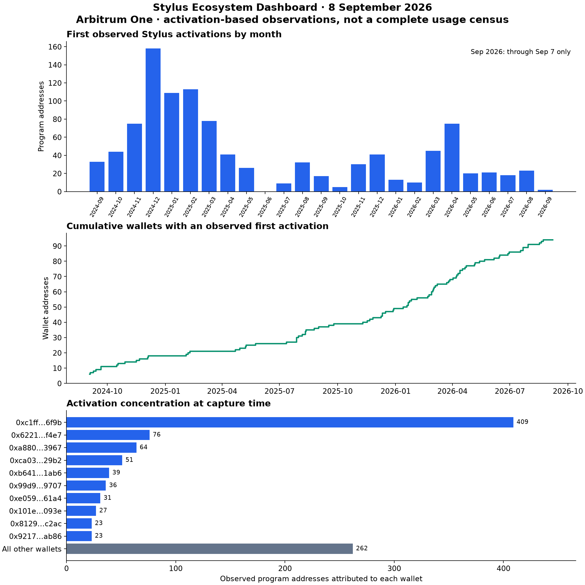

# Stylus adoption observations — 8 September 2026

The Stylus Ecosystem Dashboard recorded **1,041 program addresses with observed activation events, attributed to 95 wallets**, on Arbitrum One. Activity in this dataset is concentrated: five wallets account for **61.4%** of observed addresses. The latest 30 completed UTC days contain **15 new observed activations**, compared with **27** in the preceding 30 days.

These observations establish a public baseline for activation-based adoption indicators. They do not establish a complete census of Stylus deployments, application usage or fellowship impact. This report covers only the dashboard tooling project.

## Data provenance and cutoff

| Property                              | Value                                                                                                    |
| ------------------------------------- | -------------------------------------------------------------------------------------------------------- |
| Public source                         | [Dashboard GraphQL](https://stylus-dashboard-hql.up.railway.app/v1/graphql), queried without credentials |
| Capture interval                      | 2026-09-08 18:33:07–18:33:19 UTC                                                                         |
| Chain                                 | Arbitrum One, 42161                                                                                      |
| Configured start                      | Block 249,710,000                                                                                        |
| First daily observation               | 2024-09-03                                                                                               |
| Final observed processed/source block | 503,109,204 / 503,109,204                                                                                |
| Indexer readiness                     | `_meta.isReady = true` before and after capture                                                          |
| Deployed code observed                | `4ad27299f088397f2573a98e9d53a6b88076ba6e`                                                               |
| Period-comparison cutoff              | 2026-09-08 00:00:00 UTC, exclusive                                                                       |
| Expiry estimate reference             | 2026-09-08 18:00:00 UTC                                                                                  |

[Deployment provenance](deployment.json) separately records the running service versions. [Snapshot](snapshot.json) preserves 736 daily rows, 1,041 program rows, 95 Stylus registry rows, before/after summaries, exact query-variable records and consistency checks. Queries are [versioned in the repo](https://github.com/CoBuilders-xyz/stylus-dashboard/tree/release/scripts/report). The capture is sequential reads of a live indexer, not a block-pinned database transaction. Counts can move between calls; the checks reconcile the stored daily sums, contract rows and global totals for this capture. Matching the indexer's source block is not independent confirmation of chain finality.

## Findings

### 1. The observed wallet population grows, while activation volume varies

The captured registry contains 95 wallets, with 57 associated with more than one observed program address (**60.0%**). Of those 95 wallets, 24 appear in multiple fixed seven-day activation windows (**25.3%**). This suggests repeated participation by part of the observed address population. It does not identify 95 independent developers or a 25.3% weekly cohort retention rate.

The cumulative-wallet chart below is reconstructed from `firstStylusAt`, avoiding legacy daily cumulative-field semantics. Monthly activations vary substantially; the latest partial month must not be compared directly with complete months.



[Download the vector figure](adoption.svg). The first two panels exclude 8 September's incomplete UTC day; concentration uses the complete captured address population at capture time.

### 2. Recent first-activation volume declined

| Indicator                               | 10 Jul–8 Aug 2026 | 9 Aug–7 Sep 2026 |
| --------------------------------------- | ----------------: | ---------------: |
| New observed Stylus activations         |                27 |               15 |
| Wallets sending those first activations |                 6 |                5 |
| First-time Stylus wallets               |                 5 |                3 |
| Reactivation/keepalive events           |                 0 |               20 |
| EVM creations                           |           575,272 |          950,255 |
| Observed Stylus share of the two flows  |         0.004693% |        0.001578% |

New activations fell by **44.4%** between these two completed 30-day windows. The latter period still records new wallets and continued maintenance events. The data support a decrease in observed first activations for these periods; they do not explain why it happened or measure transaction demand. The last seven completed days, 1–7 September, contain two first activations from one wallet and no first-time wallets.

The report intentionally excludes today's incomplete day. Dashboard 30d cards include today and therefore need not match these period totals.

### 3. A small number of wallets account for most observed addresses

The largest activating wallet accounts for **409 of 1,041 addresses (39.3%)**. The five largest account for **639 (61.4%)**, and the ten largest for **779 (74.8%)**. The remaining 85 wallets account for 262 addresses.

This concentration makes total contract count sensitive to a few wallets' deployment/activation practices. It is a reason to report wallet breadth and recurrence alongside address volume. We have not attributed these wallets to named projects or teams; bots, experiments, redeployments and shared operational wallets can affect interpretation. Full public addresses and counts are preserved in [metrics.json](metrics.json), with no identity claims added.

### 4. Stylus remains a small part of this observed creation/activation comparison

The snapshot contains **9,597,626 EVM addresses** within the configured coverage. The dashboard formula gives `1,041 / (1,041 + 9,597,626) × 100 = 0.010845%` observed WASM share.

This ratio compares activation-observed Stylus addresses with trace-observed EVM creations. It does not count every Stylus address reusing existing activated code, and its two sides use different event timestamps. It is not an estimate of transaction share, execution share, gas usage or economic activity.

Among the 95 observed Stylus wallets, **46** are classified `both` in the registry. This is evidence of overlap within the captured Stylus wallet population. We do **not** report the percentage of all EVM deployers using Stylus: the public EVM-deployer aggregate was unavailable at capture time, and the snapshot intentionally avoids downloading the entire EVM registry. The UI permission failure is documented below.

### 5. Estimated activation lifecycle warrants follow-up

At the reference hour, **712** captured program records have estimated expiry in the past, **one** is within the next seven days, and **328** are in the remaining Active partition. No captured record has null expiry. Separately, **140** records have an observed cached flag; cache flags overlap expiry states and must not be added to that partition.

The estimates use a fixed 365-day lifetime from the latest mapped activation/keepalive. Codehash mappings update one address rather than all addresses sharing code. These figures motivate validating activation state against protocol-aware data; they do not demonstrate that 712 programs are abandoned, unusable or inactive in transaction terms.

## Quality checks and limitations

All seven snapshot checks passed: program-row count against aggregate, daily activations against program count, per-wallet contract counts against program count, wallet-row count against the global count, daily EVM creations against global EVM count, all program rows on chain 42161, and indexer readiness before/after capture. These are internal consistency checks, not independent proofs of complete chain coverage.

The [public deployment check](public-check.json) separately exercises five HTTP routes and eight real dashboard queries. At capture, Comparison failed because `DeployerRegistry_aggregate` was absent for the public role. Other query results used by this report were accessible. HTTP success on the Comparison route does not make that query usable. The release documents an [operator repair](../../deployment.md#existing-public-aggregate-permissions). It does not apply that repair or change integration tests.

Important dataset limits are activation-based Stylus discovery, wallet attribution, codehash-to-one-address state updates, estimated expiry, one-chain scope, live sequential reads and absence of interaction tracking. See the full [methodology](../../methodology.md). No visitor analytics, independent user testing, project adoption attribution or causal fellowship impact is asserted.

## Recommendations

1. **Publish volume together with breadth and concentration.** Continue reporting first-time wallets and returning wallets alongside addresses, using explicit UTC cutoffs. Validate large contributors before treating a volume change as broad ecosystem growth.
2. **Improve Stylus address discovery.** Add a distinct bytecode-based address inventory, including shared activated code, while keeping first activations as a separate metric. Reconcile it against known on-chain examples before changing the comparison denominator.
3. **Measure usage separately.** Research call/interaction tracking and define daily active programs from executed calls. Do not repurpose expiry status as activity.
4. **Validate lifecycle estimates.** Resolve codehash-to-many-address propagation and protocol lifetime parameters before treating expiry/cache results as operational recommendations.
5. **Keep the public evidence reproducible.** Repair Comparison aggregate access, verify normal restarts, preserve each report's snapshot and queries, and repeat the completed-period analysis at a regular interval.

These are recommendations derived from the measurements and implementation limitations, not claims that the corresponding follow-up features have shipped. [Fellowship outcomes](../../fellowship-outcomes.md) describes the capabilities delivered by the dashboard.

## Reproduce the results

Metrics need Python 3 and its standard library; figures additionally need the pinned Matplotlib dependency. From the repository root:

```bash
# Recompute from the exact committed snapshot, without network requests
python3 scripts/report/analyze.py docs/reports/2026-09-08/snapshot.json \
  --output /tmp/stylus-report-reproduction

# Optional: reproduce figures in an isolated environment
python3 -m venv /tmp/stylus-report-venv
/tmp/stylus-report-venv/bin/pip install -r scripts/report/requirements.txt
/tmp/stylus-report-venv/bin/python scripts/report/analyze.py \
  docs/reports/2026-09-08/snapshot.json \
  --output /tmp/stylus-report-reproduction --figures

# Capture a NEW live snapshot; use a new filename, not the report's frozen input
python3 scripts/report/capture.py --output /tmp/stylus-report-new-snapshot.json
```

`analyze.py` refuses snapshots with failed recorded checks. New live captures can fail reconciliation if the indexer changes during pagination; investigate or recapture rather than silently comparing inconsistent totals. Query pagination uses ordered IDs and continues until an empty page, including when a server-side cap returns fewer than the requested 250 rows. GraphQL/HTTP errors abort capture instead of becoming zero counts.

The committed snapshot's SHA-256 is `83815c00d5df503247365991d58395885aeefb02e86010f75e01e2c4aba6d6a9`. [metrics.json](metrics.json) records that hash and all derived values used here. Public evidence artifacts in this folder are distributed with the repository's [MIT license](https://github.com/CoBuilders-xyz/stylus-dashboard/blob/release/LICENSE).
