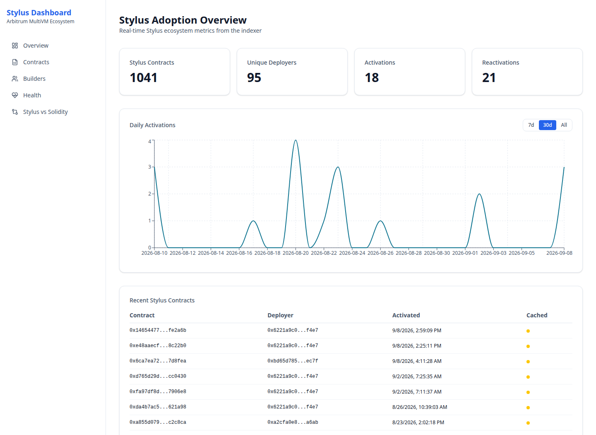
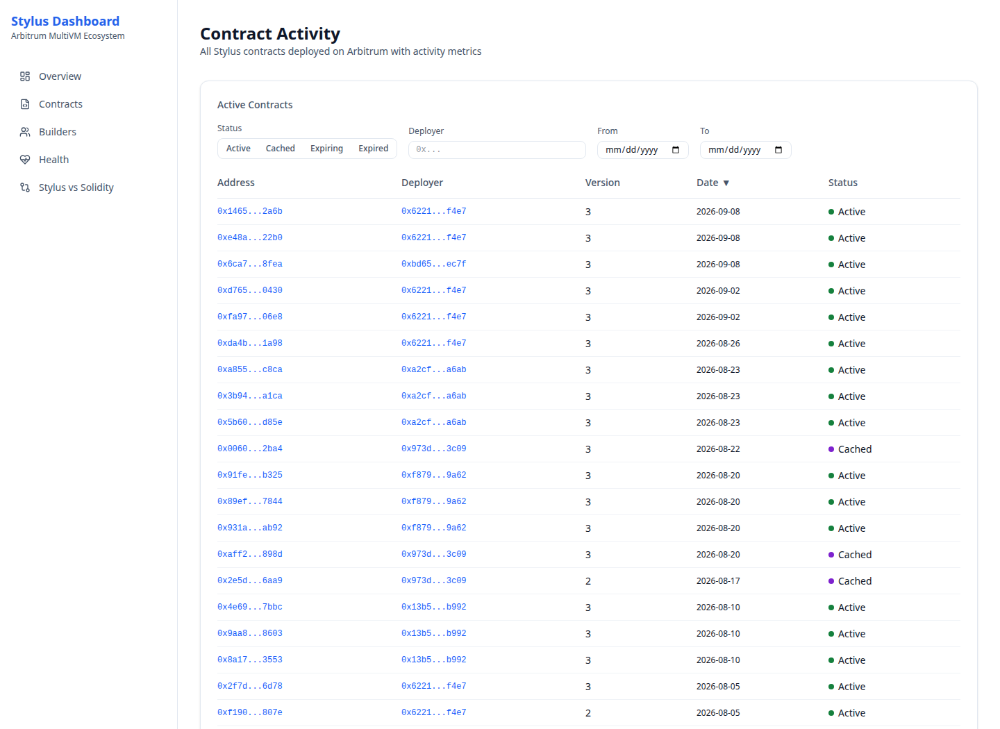
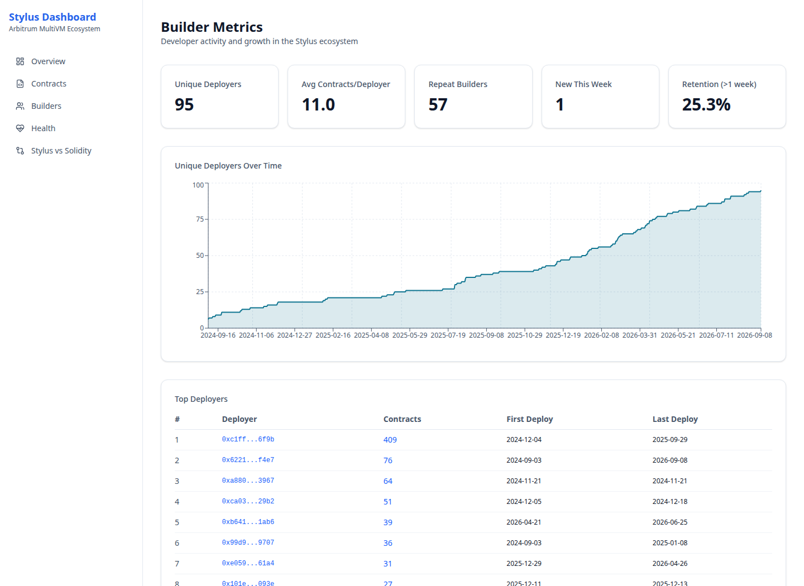
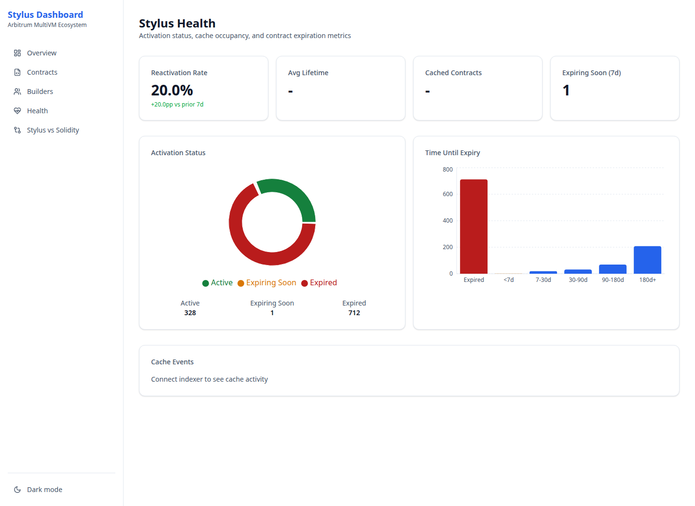

# Usage guide

Open the [public dashboard](https://stylus-dashboard.up.railway.app). No account or wallet connection is required. Data comes from Arbitrum One; consult the [methodology](methodology.md) for coverage and definitions.

Screenshots show the public dashboard on **8 September 2026**; live values will change.

## Overview

Contract and deployer cards cover all indexed history. Activations and Reactivations cover 30 UTC dates ending today, including today's partial data. The chart's **7d / 30d / All** control changes only the chart period.

The recent-contract table shows ten entries. In the daily table, Total Contracts is a per-day counter despite its label; use the top Stylus Contracts card for the current total.

Daily Activations shows first observations of program addresses in activation events. Reactivations include repeated activations and keepalives. For definitions, see [what gets counted](methodology.md#what-gets-counted).

## Contracts

Use the status buttons, full deployer address and From/To activation dates to narrow the table. Multiple statuses are combined with OR; status, deployer and dates are combined with AND. Both date endpoints refer to UTC dates and the To date includes the whole day. Deployer matching is exact and normalized to lowercase, not a partial-address search.

Click sortable column headings to change ordering. Pagination returns 20 rows per page and the count reflects the same filters. Filtering returns to the first page. Filters and sorting are encoded in the URL, so a copied URL preserves the view.

Example: [programs activated during August 2026](https://stylus-dashboard.up.railway.app/contracts?from=2026-08-01&to=2026-08-31). To investigate one wallet, click its contract count on Builders or paste its full address into the deployer filter. Address links open Arbiscan for independent inspection.

Status priority is Expired, Expiring within seven days, Cached, then Active. These statuses use estimated expiry. A cached program close to expiry appears as Expiring; the Cached filter therefore does not return every row whose raw `isCached` field is true.

## Builders

Unique Deployers counts activating wallets. Repeat Builders counts wallets associated with more than one first observed program activation. New This Week covers seven UTC dates ending today. The card labeled Retention (>1 week) is the fraction observed activating new programs in multiple fixed seven-day windows; it is not weekly cohort retention.

The leaderboard shows the top ten wallets. Click a Contracts value to inspect the associated records. Wallets can be shared or controlled by the same organization, so leaderboard entries do not identify independent teams.

## Health

Read Health as **estimated activation state**. The pie partitions records into Active, Expiring Soon and Expired. The histogram groups estimated remaining time; both use the same hour-rounded reference time. An expired estimate is not proof that the program is unused or cannot execute now.

Reactivation Rate divides repeated activations plus keepalives by new activations in the recent window. It may exceed 100%. A dash means that its denominator is zero. The change annotation is percentage points compared with the prior window. Observed cache status is available in Contracts; average lifetime and a cache-event chart are not implemented in this release.

## Stylus vs Solidity (EVM comparison)

[Open Comparison](https://stylus-dashboard.up.railway.app/comparison) to compare observed Stylus activations with EVM creations. The page is labeled Stylus vs Solidity; its EVM data includes all source languages.

WASM Share uses the two indexed contract populations as its denominator. Total Contracts and Deployers cover indexed history; Deploys/day averages the latest 30 UTC dates. The 7d share annotation is a window-specific share, not percentage-point growth. The daily count chart uses a logarithmic axis because EVM counts are much larger. The share chart normalizes each day's two counts. Both charts share the selected period: changing either period control updates both charts.

Deployer Overlap asks how many registry addresses classified as EVM have also been observed on the Stylus side. It requires public aggregate permissions. At the 8 September 2026 check, the missing permission caused Comparison to fail. See the [repair procedure](deployment.md#existing-public-aggregate-permissions) and [dated check](reports/2026-09-08/public-check.json).

## Navigation, sharing and refresh

Use the sidebar on a desktop-width screen to switch between sections. On narrow screens, the dashboard sidebar is hidden; use this guide's direct page links. Its sidebar theme control switches between light and dark appearance.

Most main queries refresh every five seconds; full-history/growth queries use 60 seconds. A chart can show loading separately from the main cards. A data error or dash is not a zero-adoption finding. Use Retry or reload, then file a [bug](https://github.com/CoBuilders-xyz/stylus-dashboard/issues/new?template=bug.yml) with route, time, filters and error text.

For a shareable, fixed result use the [dated ecosystem report](reports/2026-09-08/README.md), which preserves its input data and formulas. The report provides JSON downloads; the dashboard has no CSV export.
